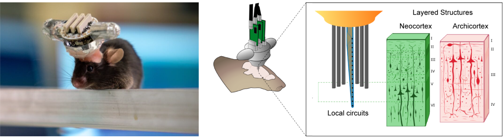

# The Hybrid Drive

A chronic implant device combining tetrode arrays with silicon probes for layer-resolved ensemble physiology

<p align="center">

</p>

This repository contains the following:

* **Parts**: A [list](https://github.com/MatteoGuardamagna/Hybrid_drive/blob/main/docs/parts_list.md) of parts needed to build the drive. Including [flexDrive](https://github.com/open-ephys/flexDrive) git repositories for the drive body and the screw-spring mechanism.
* **Building instructions**: a step-by-step [guide](docs/Hybrid_Drive_Protocols.pdf) on how to build the drive.
* **Implant instructions**: a quick [guide](docs/implant_procedure.pdf) on how to implant the Hybrid drive.
* **Array design**: a [repository](https://github.com/MatteoGuardamagna/Hybrid_drive/tree/main/docs/array_design) with all tested implant designs. 
* **Videos and images**: A collection of [images](https://github.com/MatteoGuardamagna/Hybrid_drive/tree/main/images) and [videos](https://github.com/MatteoGuardamagna/Hybrid_drive/tree/main/videos) of the hybrid drive, before and after the implant procedure.


## News
- 20/08/2021 the Hybrid Drive preprint is out on [biorxiv](https://www.biorxiv.org/content/10.1101/2021.08.20.457090v1)

## Step-by-step building instructions

<p align="center">

</p>

[1. Parts list](docs/parts_list.md)

[2. Building instructions](docs/Hybrid_Drive_Protocols.pdf)

[3. Implant procedure](docs/implant_procedure.pdf)


## Scientific aproach

Many brain areas, including the cortex and the hippocampus, are organized in local circuits and laminar structures with information processing within and across layers. Simultaneously measuring neural activity across these two dimensions, while an animal is freely interacting with its environment, remains a key challenge in modern neuroscience. We aim to tackle this challenge with the Hybrid Drive, combining in a single device the flexibility of tetrode arrays with the spatial coverage of silicon probes. This microdrive enables novel insights on the relation between layer-specific and across-layer neural activity, with high spatial and temporal precision, in freely moving mice. 

<p align="center">

</p>

## Contribute

Different area-specific arrays can be found in the [array_design](https://github.com/MatteoGuardamagna/Hybrid_drive/tree/main/docs/array_design) folder. Please create a *pull request* to contribute new or improved designs.

The silicon probes and the EIB desgin can be adapted as well, according to experimental demands. We actively collaborate with [ATLAS Neuro](https://www.atlasneuro.com/) to develop new designs. For further information, feel free to contact me at guardamagnamatteo@gmail.com

## References

```
@Article{Guardamagna2021,
  author    = {Guardamagna, Matteo and Eichler, Ronny and Pedrosa, Rafael and Aarts, Arno and Meyer, Arne F. and Battaglia, Francesco P.},
  title     = {The Hybrid Drive: a chronic implant device combining tetrode arrays with silicon probes for layer-resolved ensemble electrophysiology in freely moving mice},
  journal   = {bioRxiv},
  year      = {2021}
}
```


